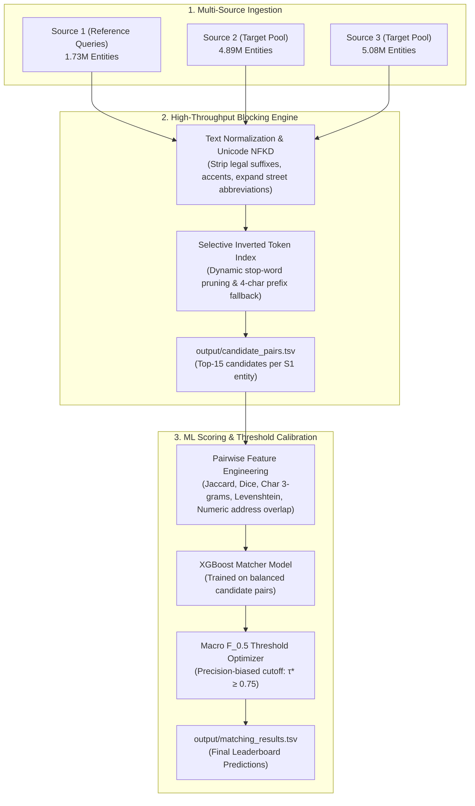

# 🏢 Amazon ML Challenge 2026: Business Entity Resolution

[](https://www.python.org/)
[](https://opensource.org/licenses/Apache-2.0)
[](#)
[](#)

An end-to-end, high-throughput Machine Learning pipeline for resolving and linking business identities across large-scale, heterogeneous, and noisy commercial databases.

---

## 📌 1. Challenge Overview

In large commercial platforms, business identity records originate from multiple independent data sources without shared identifiers. Each source contributes noisy, incomplete fragments. 

- **Query Anchor:** **Source 1 ($\mathcal{S}_1$)** is the deduplicated reference source ($1,732,544$ test queries).
- **Target Candidates:** **Source 2 ($\mathcal{S}_2$)** and **Source 3 ($\mathcal{S}_3$)** contain noisy candidate records (~$9.97$ million target entities).
- **Goal:** Determine which target records in $\mathcal{S}_2$ and $\mathcal{S}_3$ represent the same real-world business entity as each $\mathcal{S}_1$ query.
- **Match Cardinality:** An $\mathcal{S}_1$ entity may match $0$ (singleton), $1$, or multiple records.

### ⚠️ Key Complexity Factors
1. **Combinatorial Search Explosion:** Naive pairwise comparison requires $\approx 1.73 \times 10^{13}$ (17.3 Trillion) comparisons. Brute-force pairwise scoring is intractable.
2. **Open-Set Country Shift (Zero-Shot France):** Training records cover only `US` and `India`, whereas test records introduce `France`. Hardcoded postal codes or state abbreviations fail zero-shot.
3. **Severe Singleton Penalty under $F_{0.5}$:** The evaluation metric weighs precision $4\times$ heavier than recall ($1/\beta^2 = 4$). False merges on singletons reduce their score immediately from $1.0 \to 0.0$.

---

## 📐 2. System Architecture

The solution uses a decoupled two-stage architecture: **Candidate Generation (Blocking)** followed by **Pairwise ML Verification & Threshold Calibration**.



---

## 📂 3. Repository Structure

```
Amazon-ML-Challenge-2026/
├── README.md                                # Root repository guide (this file)
├── Documentation_template.md                # Solution methodology write-up
├── .gitignore                               # Clean repository exclusions
├── code/
│   └── business_entity_resolution/
│       ├── requirements.txt                 # Pinned dependencies
│       ├── README.md                        # Reproduction handbook
│       └── src/
│           ├── __init__.py
│           ├── config.py                    # Central paths & parameters
│           ├── preprocess.py                # Unicode & multilingual cleaning
│           ├── blocking.py                  # Inverted-index candidate generator
│           ├── features.py                  # Pairwise similarity feature extractors
│           ├── model.py                     # XGBoost classifier & threshold tuner
│           ├── evaluate.py                  # Official macro F_0.5 metric implementation
│           └── pipeline.py                  # End-to-end training & inference runner
├── output/
│   ├── candidate_pairs.tsv                  # Stage 1 blocking candidates
│   └── matching_results.tsv                 # Stage 2 final matching predictions
└── student_resource/
    ├── README.md                            # Competition problem statement
    └── utils/
        └── validate_submission.py           # Official format & schema validator
```

---

## 🚀 4. Quickstart & Installation

### Step 1: Clone and Set Up Environment
```bash
git clone https://github.com/Saimanisuper/amazon-business-entity-resolution.git
cd amazon-business-entity-resolution

# Create and activate a virtual environment
python -m venv venv
# On Windows:
.\venv\Scripts\activate
# On Linux/macOS:
source venv/bin/activate

# Install dependencies
pip install -r code/business_entity_resolution/requirements.txt
```

---

## ⚡ 5. How to Run the Pipeline

### Option A: Quick Benchmark / Sample Verification
Runs training on a representative sample and generates predictions on a test slice in **under 20 seconds**:
```bash
cd code/business_entity_resolution
python -m src.pipeline --mode sample --sample-size 2000
```

### Option B: Full-Scale Test Inference (1.73M Entities)
Trains the XGBoost matcher on the training set and streams inference over all 1.73 million test entities:
```bash
cd code/business_entity_resolution
python -m src.pipeline --mode full
```

Output files will be written to `output/`:
- `output/candidate_pairs.tsv`
- `output/matching_results.tsv`

---

## 🧪 6. Format Validation

Before submitting to the portal, validate the output files against official competition rules:

```bash
cd student_resource
python utils/validate_submission.py \
    --matching ../output/matching_results.tsv \
    --candidate ../output/candidate_pairs.tsv \
    --test-dir dataset/test
```

### Checks Enforced by Validator:
- ✅ **Strict TSV Tab Delimiters:** Columns separated by single `\t` characters.
- ✅ **Required Header Names:** `source1_entity_id \t matched_entity_ids` and `source1_entity_id \t candidate_entity_ids`.
- ✅ **Subset Invariance Rule:** Every ID in `matching_results.tsv` is strictly a subset of `candidate_pairs.tsv`.
- ✅ **Singletons:** Correctly formatted with empty match strings (no quotes).
- ✅ **No Duplicate IDs / No Self-Matches.**

---

## 📊 7. Evaluation Metric ($F_{0.5}$)

Submissions are scored using the **macro-averaged $F_{\beta}$ score ($\beta = 0.5$)**:

$$F_{0.5} = \frac{(1 + 0.5^2) \times \text{Precision} \times \text{Recall}}{(0.5^2 \times \text{Precision}) + \text{Recall}} = \frac{1.25 \times P \times R}{0.25 \times P + R}$$

* **Why Precision Matters:** In production business entity resolution, falsely merging two distinct businesses is far more costly than missing an ambiguous match. $F_{0.5}$ assigns **$4\times$ penalty weight to false positives** relative to false negatives.
* **Singleton Handling:** A Source 1 entity with zero true matches earns **$1.0$** if an empty list is predicted, and drops to **$0.0$** if any false positive candidate is merged. Our high-threshold calibration ($\tau^* \ge 0.75$) provides protection against singleton collapse.

---

## 📦 8. Final Submission Package Structure

To submit the final archive:
```
<team_name>_submission.zip
├── output/
│   ├── matching_results.tsv
│   └── candidate_pairs.tsv
├── code/
│   └── business_entity_resolution/
│       ├── src/
│       ├── README.md
│       └── requirements.txt
└── Documentation_template.md
```

---

## 📜 9. Constraints & Fair Play Compliance

- **No External Data Lookup:** Completely self-contained. Zero external geocoding, Google Maps, web scraping, or corporate registries used.
- **Model Size:** XGBoost model parameter footprint is $< 50\text{ MB}$, well below the 8 Billion parameter ceiling.
- **License Compliance:** 100% open-source permissive licensing (Apache 2.0 / MIT).

---

## 👨‍💻 Author & Contact
- **GitHub:** [@Saimanisuper](https://github.com/Saimanisuper)
